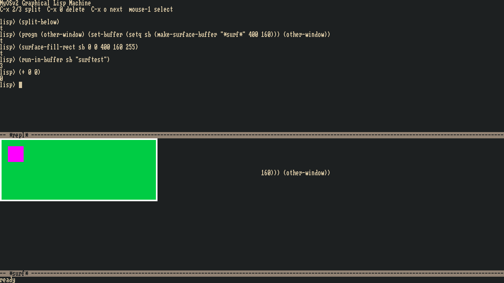
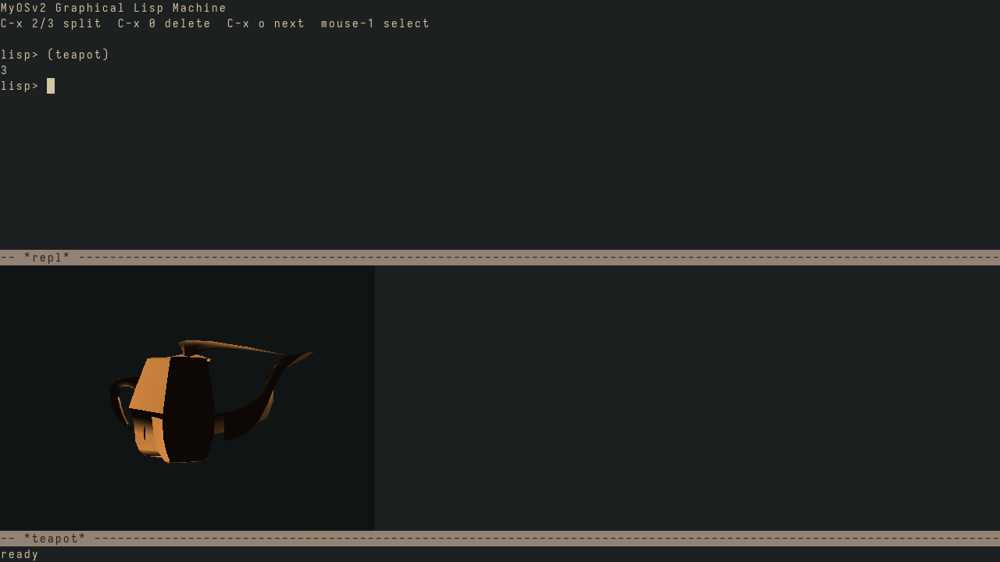
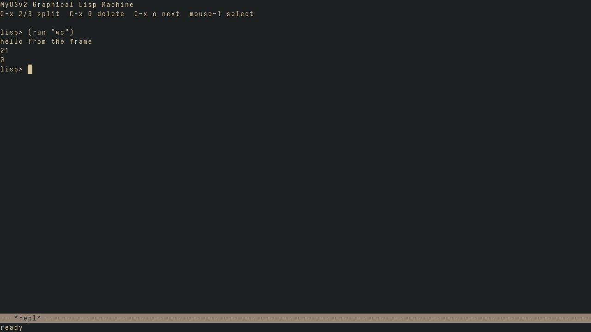
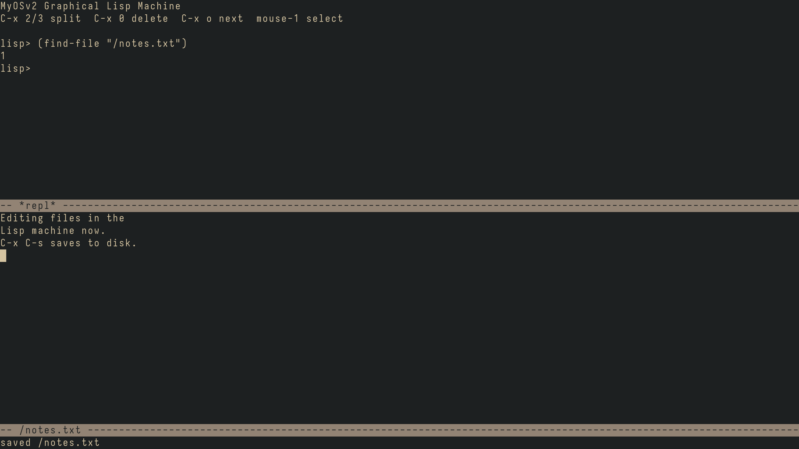

# MyOSv2 — a graphical Lisp machine on a Unix-shaped kernel

A little operating system for **ARM64 (AArch64)**, written from scratch in C,
assembly and Lisp, running on QEMU's `virt` board. It boots into a live,
redefinable **Lisp image** that is simultaneously the init process, the shell,
and — since Phase 25 — an Emacs-style **graphical machine**: tiled windows,
buffers, anti-aliased text, a vertico-style `M-x`, and external programs
rendering into buffers.


*One frame, all of it live: a bar chart drawn from the REPL into a surface
buffer, `frame-loop`'s actual lambda displayed from the running image, and a
vertico-style `M-x` filtering the machine's own symbol table.*

This is a **vibe-coded OS, built just for fun** — to learn how computers and
operating systems actually work, and to see how far we can get. No grand plan,
no deadlines; just building it one piece at a time and enjoying the ride.

## Architecture: three layers, three languages of responsibility

**1. The kernel (C) — mechanism, never policy.** A classic Unix-shaped kernel:
MMU with per-process page tables and ASID-tagged TLBs, fork with copy-on-write,
an ELF64 loader with the full exec/exit/wait lifecycle, a VFS with a persistent
**ext2 root filesystem** on disk (plus an in-memory ramfs for tests), pipes,
signals, a BSD-style socket API over a from-scratch
TCP/IP stack, and virtio drivers (block, net, **gpu, input**) on a shared
virtio-mmio transport. Everything is interrupt-driven — blocked readers sleep
and are woken, never polled. The kernel knows nothing about Lisp, buffers or
windows; its entire graphics vocabulary is four syscalls (`gfx_acquire`,
`gfx_flush`, `input_read`, `seat_switch`) plus a **seat** table that decides
which process owns the screen — the Linux virtual-terminal model, so several
complete Lisp machines can share the display and swap with Ctrl-Alt-Fn.

**2. The Lisp machine (`/bin/lisp`) — the userland IS a live image.** The
language core (`src/lm_core.c`: reader, evaluator, printer, mark-and-sweep GC
with conservative C-stack scanning, Lisp-2 with closures and macros) is one
portable, libc-free file compiled BOTH into the kernel — so the in-kernel test
suite red-greens the language itself — and into `/bin/lisp`, where syscall
primitives (`user/lm_sys.c`) expose fork/exec/wait/pipes/sockets to Lisp.
PID 1 is this Lisp machine: the OS boots into a REPL whose shell (`system.l`)
runs ELF programs and real pipelines as S-expressions, and whose network REPL
(`lisp -serve`) lets Doom Emacs eval forms into the running OS over TCP. The
image persists, accretes, and can be redefined while it runs — the Emacs
architecture applied to an operating system.

**3. The graphics subsystem — Emacs, all the way down.** The redisplay engine
(`src/rd_core.c`, dual-built like the Lisp core) implements **glyph matrices**:
Lisp mutates buffers (gap buffers), a window tree and faces; redisplay lays
them out into a cell grid, diffs against what's on screen, paints only changed
cells with prerendered **anti-aliased TTF glyphs** (integer alpha blending —
the FPU is never enabled), and flushes minimal damage rects to virtio-gpu.
Everything above the engine is live Lisp in `frame.l`: the event loop, the
`C-x` keymaps, mouse handling, the REPL-as-buffer, and a vertico-style
minibuffer where `M-x` completes over the image's own symbol table and
`C-h f` shows a function's *living source* — the very lambda the machine runs.
A buffer can also be a **pixel surface** an external ELF renders into via
shared memory (`(run-in-buffer ...)`) — EXWM, native. And the machine can
photograph itself: `(screenshot "/shot.ppm")`.



## What it can do today

- **Boot & serial** — `_start`, stack/`.bss` setup, PL011 UART, `kprintf`.
- **Exceptions & interrupts** — vector table, syscalls (`svc`), GIC, 1000 Hz timer.
- **Memory** — physical page allocator, a coalescing kernel heap, the MMU with
  per-process page tables, ASID-tagged TLB entries (flush-free context switch).
- **Scheduler** — preemptive threads with priorities, sleep, round-robin, and a
  V6-style **sleep/wakeup** (`sched_block`/`sched_wake`) so blocking I/O sleeps
  instead of spinning.
- **Interrupt-driven I/O** — the console and NIC are driven by interrupts, not
  polling: a UART receive IRQ feeds the **tty line discipline** (Ctrl-C → SIGINT),
  `read` blocks until a key is pressed, and the virtio-net IRQ wakes the network
  stack (a blocked `ping` is woken by the reply, or aborted instantly by Ctrl-C).
- **Filesystem** — a VFS (vnode/fs_type) whose **root `/` is a persistent on-disk ext2 filesystem**; an in-memory `ramfs` remains for the self-tests.
- **Processes** — user mode at EL0, `fork` + copy-on-write, an **ELF64 loader**,
  and the full lifecycle: `exec`, `exit(status)`, `wait`/reap (with ASID + page
  recycling).
- **Userland** — an interactive shell that runs real ELF programs from `/bin`
  (`true`, `false`, `hello`, `mtest`) via fork→exec→wait and reports their exit
  status. (Since Phase 24 the C shell lives at `/bin/sh`; **init is the Lisp
  machine** — see below.)
- **User-space memory** — `sbrk`-grown per-process heap (demand-zeroed pages) and
  a small `malloc`/`free`; anonymous `mmap`; and **shared memory** objects two
  processes can map to communicate.
- **Pipes** — `pipe` + `dup2` with refcounted file handles, so the shell runs
  pipelines like `hello | wc`.
- **Signals** — `kill`, default actions, user handlers (with a sigreturn
  trampoline), and **Ctrl-C** → `SIGINT` to the terminal's **foreground process
  group**. The tty tracks that group (`tcsetpgrp`/`TIOCSPGRP`, which ash sets per
  job), so a single `tty_intr()` — shared by the serial line discipline and the
  graphical keyboard (consumed in `SYS_INPUT_READ`) — interrupts a whole job,
  including one a busybox-sh put in its own group, while the shell survives. Both
  the legacy `signal`/`sigreturn` and the real-numbered `rt_sigaction`/
  `rt_sigreturn` feed one delivery path, so musl binaries install handlers too.
  (Interrupting a CPU-bound *Lisp eval* in the graphical frame is a known gap.
  Detecting C-c mid-eval is solvable — drain + a Ctrl-C line-discipline in the
  input ISR, as the UART has — but that alone wedges the frame: the REPL
  evaluates *in-process inside the event loop* (`frame-tick`), so `longjmp`-ing
  out of the interrupted `lm_eval` unwinds the loop machinery and leaves the
  frame inconsistent. A clean fix needs the eval isolated from the event loop —
  e.g. run REPL evals in a forked child so C-c kills the child untouched.)
- **Block device** — a **virtio-blk** disk driver on a generic virtio-mmio +
  virtqueue layer, reading and writing 512-byte sectors.
- **Persistent filesystem** — a real on-disk **ext2** filesystem mounted as the
  root `/` (inodes with direct + single/double/triple indirect blocks, so files
  are no longer capped at a few KiB). The image is host-built with `mke2fs -d`,
  installing the full userland (`/bin`, `/lib`, `/usr`) onto `build/disk.img`;
  the kernel mounts it as `/` at boot and halts with a clear message if it can't.
  Full read **and** write: bitmap block/inode allocation, file
  create/write/grow (allocating indirect blocks on demand), truncate, and
  unlink — all write-through, leaving an `e2fsck`-clean image. Plus read-only
  **symlinks** (ext2 fast/slow symlinks; the VFS follows them during path
  lookup, depth-capped) — that's how a bare `ls` resolves through `/bin/ls →
  busybox`. On-device edits and newly created files survive reboots; the `/boots`
  counter proves it (verified by `tools/persist_check.py`). Rebuilding `disk.img`
  (`make` when its inputs change, or `make fresh-disk`) is a deliberate reflash
  that resets the system files — the running machine never touches them except
  when you save.
- **Network interface** — a **virtio-net** driver that sends and receives raw
  Ethernet frames (verified with an ARP round-trip to QEMU's gateway).
- **TCP/IP stack** — Ethernet, **ARP** (resolve/cache/reply), **IPv4** (checksum
  + next-hop routing), **ICMP** echo, **UDP**, and a minimal **TCP** client with
  **out-of-order reassembly** (a dropped/reordered segment no longer discards the
  rest of the stream), **adaptive retransmission** (RFC 6298 RTO estimation,
  Karn's algorithm, exponential backoff), **flow control** (honors the peer's
  advertised window; advertises its own from real receive-buffer space), and
  **Reno congestion control** (slow start, congestion avoidance, fast
  retransmit/recovery), and a **full RFC 793 state machine** (graceful four-way
  close — CLOSE_WAIT/LAST_ACK, FIN_WAIT/CLOSING/TIME_WAIT — and RST replies to
  stray segments). Writes larger than one MSS are **segmented** and pipelined up
  to the window (with Nagle); `/bin/httpd` serves a 4 KB body in several segments.
- **Sockets** — a BSD-style socket API: `socket`/`bind`/`sendto`/`recvfrom` for
  UDP datagrams, and `socket(SOCK_STREAM)`/`connect`/`listen`/`accept` +
  `read`/`write` for TCP — both client *and* server. `/bin/dnsq` does a DNS lookup
  over UDP sockets; `/bin/http` fetches a page over TCP (`GET example.com` →
  `HTTP/1.1 200 OK`) — out to the real internet; `/bin/httpd` is a tiny HTTP
  server: run it, then `curl http://localhost:8080/` from the host reaches it
  (QEMU forwards host:8080 → guest:8080). `poll()` waits on several fds at once
  (sockets, pipes); `shutdown()` half-closes a TCP connection. `/bin/polldemo`
  shows `poll()` blocking on a pipe a forked child fills.
- **DNS + ping** — a **DNS resolver** over UDP (now with a real **UDP transmit
  checksum**) and a user-space `ping` that takes a hostname:
  `ping https://www.google.com` strips the scheme, resolves the name, and
  ICMP-echoes the address.
- **DHCP** — the guest **leases its address at boot** (DISCOVER/OFFER/REQUEST/ACK)
  instead of hardcoding it, **applies the offered gateway/DNS/subnet mask**, and
  **renews the lease** (RFC 2131 T1 renew / T2 rebind, activity-driven). The whole
  stack is runtime-configurable, falling back to built-in defaults if no server
  answers.
- **Program arguments** — `exec` passes `argv` to programs; the shell tokenizes
  the command line, so `/bin/ping <host>` and friends get their arguments.
- **`shutdown`** — a shell command that halts the machine via PSCI (QEMU exits).
- **Linux/aarch64 ABI (musl)** — the syscall ABI *is* the Linux aarch64 ABI
  (numbers in `x8`, negative-errno, the `*at`-family, an `auxv` initial stack),
  so **unmodified static musl binaries run**: `/bin/busybox` (echo, `uname -a`,
  `ls` via `getdents64`, …) and small `aarch64-linux-musl-gcc -static` programs.
  See **[docs/superpowers/specs/2026-06-15-musl-port-design.md](docs/superpowers/specs/2026-06-15-musl-port-design.md)**.
- **Interactive busybox shell** — `(run "busybox" "sh")` drops you into a real
  `ash` prompt over the console: terminal `ioctl`s make `isatty()` true, and bare
  command names (`ls`, `cat`, `grep`, …) resolve through **`/bin` symlinks** to
  the busybox multicall binary. ext2 grew read-only **symlink** support and the
  VFS follows them during path lookup; `rt_sigaction`/`getpgid`/`ppoll` round out
  the job-control syscalls ash needs.
- **I/O redirection + the coreutils syscalls** — `>`, `>>`, `<`, `2>`, and
  pipelines all work in the shell. stdin/stdout/stderr are modelled as a
  **console-backed file** so ash can save and restore a redirected fd
  (`dup3`/`pipe2` are musl's `dup2()`/`pipe()`; `fcntl(F_DUPFD_CLOEXEC)` returns
  a real fd; `openat(O_APPEND)` appends). The everyday commands have their
  syscalls too: `rm` (`unlinkat`), `chmod` (`fchmodat`), `touch` (`utimensat`),
  `sleep` (`nanosleep`), `cat` (`sendfile`), plus `readlinkat`/`faccessat`/
  `ftruncate`. The legacy MyOSv2 socket calls had squatted on the Linux `*at`
  numbers 31–39 (silently misrouting `rm`/`mkdir`/`ln` to `connect`/`listen`/…);
  they moved to a private range so the Linux numbers are free.
- **File management on the ext2 root** — `mkdir`, `ln -s`, `ln` (hard), and `mv`
  all work on disk. ext2 grew write-side directory ops: **symlink** creation
  (fast inline targets), **rename** (relink an inode under a new name, fixing
  `..` and link counts when a directory changes parent), and **hard links**
  (a second name sharing one inode); `mkdir` reuses the directory-create path.
  (`rmdir`/`rm -r` are still TODO -- directory *removal* isn't wired yet.)
- **Compiles C *on the machine*, against a real libc** — `/bin/tcc` is a
  static-musl [TinyCC](https://repo.or.cz/tinycc.git) that runs on MyOSv2 and
  compiles + links C in one process. A **musl sysroot is baked onto the ext2
  root** (`/usr/{include,lib}`), so `(cc "/hello.c" "/hello")` links a
  `#include <stdio.h>` program that calls `printf` into a runnable static ELF,
  and `(run-file "/hello")` runs it — a hosted C toolchain on the OS, not a
  cross-compile. `(cc-bare ...)` keeps the freestanding (no-libc, `mycrt.S`)
  path. Build notes: `user/musl/README-tcc.md`.
- **Lisp machine** — `/bin/lisp` is a full **Emacs-architecture Lisp** running at
  EL0: tagged 64-bit objects, a **mark-and-sweep collector with conservative
  C-stack scanning** (so it can collect mid-computation in a long-lived process),
  **Lisp-2** with separate value/function slots, tail-call optimization, closures
  and `defmacro`. The reader/evaluator/printer are a single portable core shared
  with the kernel, so the in-kernel test suite red-greens the language itself. It
  boots its standard library from `/lib/bootstrap.l` and gives you an interactive
  REPL with error recovery (a typo doesn't kill the session). The plan is for Lisp
  to become the primary userland — see **[docs/ROADMAP.md](docs/ROADMAP.md)**.
- **Network REPL (Emacs ↔ the live image)** — `lisp -serve` serves the REPL over
  TCP (blocking `accept`, one connection at a time); QEMU forwards host:7777 →
  guest:7777. The image **persists across connections** — disconnect, reconnect,
  and your defuns are still there. `user/lisp/lm-mode.el` wires it into (Doom)
  Emacs: `M-x lm-connect`, then `C-c C-e` evals the form before point into the
  running OS. **The connection is the terminal**: the socket is `dup2`'d onto
  fds 0/1/2 for the session, so errors, `(run ...)` output and even pipelines
  with in-image stages all come back to your editor, remote-shell style.
- **Lisp ↔ kernel** — the syscalls are Lisp primitives (`user/lm_sys.c`):
  `(fork)`, `(exec path argv)`, `(wait)`, pipes, `dup2`, files and sockets.
  `(if (= (fork) 0) (exec "/bin/hello" ...) (wait))` is the whole Unix process
  model in one S-expression, typed into a live REPL.
- **The shell is Lisp** — `system.l` builds an Eshell-style shell from those
  primitives: `(run "hello" "arg")` fork/execs an ELF and waits;
  `(| (run "hello") (run "wc"))` is a real pipe between forked children — and
  stages can be plain Lisp: `(| (princ "abcde") (run "wc"))` → `5`. `(ls)` and
  `(cat ...)` are coreutils written in Lisp.
- **Input devices** — IRQ-driven **virtio-input** keyboard + absolute-pointer
  tablet; events reach userland as evdev triples through a blocking
  `input_read` syscall (`/bin/evtest` to watch them). First brick of the
  graphical Lisp machine (Phase 25).
- **Display** — a **virtio-gpu** framebuffer: `gfx_acquire` maps a 1280×720
  BGRX framebuffer into a process; `gfx_flush` pushes damage rects to the
  scanout. `/bin/gfxtest` paints the screen from userland, verified down to
  exact pixels by a QMP screendump check.
- **The graphical Lisp machine** — `lisp -frame` boots an Emacs-style frame:
  tiled windows showing buffers, modelines, an echo area, a block cursor — the
  redisplay engine (`src/rd_core.c`, glyph matrices + damage diff) is C; the
  event loop, keymaps (`C-x 2/3/0/o`), mouse handling and the REPL itself are
  **live Lisp** (`frame.l`) you can redefine from that very REPL. The machine
  can photograph itself: `(screenshot "/shot.ppm")`. Text is **anti-aliased**
  (prerendered TTF glyphs, integer alpha blending — no FPU needed).
  **Multiple Lisp VMs**
  share the screen VT-style — `(spawn-vm)`, then Ctrl-Alt-F1..F4 — and a
  buffer can be a **pixel surface** that an external program renders into via
  shared memory (`(run-in-buffer buf "surftest")`) — EXWM, native.
- **3D, for real** — the FPU is enabled (per-thread FP state, context-switched),
  user programs compile with floats/NEON, and a vendored **TinyGL** (software
  OpenGL 1.x) renders the **Utah teapot** — Newell's 1975 Bézier patches,
  tessellated and lit — spinning at 25fps inside an Emacs-style buffer:
  type `(teapot)` at the REPL. It keeps spinning while other commands
  stream output, and C-c interrupts a whole job -- the kernel grew Unix
  **process groups** (`setpgid`) and a tty **foreground process group**
  (`tcsetpgrp`), so the graphical Ctrl-C signals the program doing the work
  (even one busybox-sh placed in its own group), not the shell around it.
  
- **Interactive input in the buffer** — a program run from the frame reads its
  **stdin from the frame's own keyboard**, not the serial port: what you type
  echoes into the buffer and feeds the program, **RET** sends a line, **C-d**
  is end-of-input, **C-c** still kills the whole job. So `(run "wc")` is a live
  filter you type into and end with C-d — the terminal, finally complete inside
  the frame (a forked child gets its fd 0 from a pipe the event loop drives).
  
- **Editable file buffers** — `(find-file "/path")` opens a file in a split
  window; switch in with `C-x o` and it's a real editor (RET inserts a newline,
  arrows/`C-b`/`C-f` move point, backspace deletes), and **`C-x C-s`** saves it
  back to disk. The Emacs-machine loop — open, edit, save — closed.
  
- **M-x + describe-function, vertico-style** — the echo area grows into a
  live-narrowing command palette over the image's own symbol table; `C-h f`
  shows a function's *living source* in a `*Help*` window, ready to redefine.
- **Major modes** — the frame boots into `*scratch*` (lisp-interaction-mode:
  `C-j` evaluates the form before point and inserts the result inline). `C-x C-f`
  opens a file in `text-mode` in the current window; `C-x C-s` saves; `C-x r`
  opens a REPL (repl-mode) in the current window. The mode line names the active
  mode, and `C-h m` / `C-h b` describe it from the live keymaps. Surface buffers
  (the teapot canvas and friends) use `surface-mode`. The hierarchy is
  `special-mode` (inert root) → `surface-mode` + `fundamental-mode` →
  `text-mode` / `repl-mode` / `lisp-interaction-mode`.
- **Text properties + ANSI color** — buffers carry genuine **Emacs text
  properties**: `put-text-property` / `get-text-property` / `set-text-properties`
  / `propertize` over character ranges (stored as intervals the GC traces), with
  `face` the display property the renderer paints per character. Faces are named
  and themeable (`defface` / `set-face-attribute`, merged left-to-right like
  Emacs). An `ansi-color-apply` filter (the `ansi-color.el` analog) translates a
  program's **SGR escape sequences** into `face` properties — so `busybox ls`
  streams into the buffer with its directories rendered in color, the raw
  `ESC[1;34m` bytes stripped, not shown.
- **VT100 terminal — `vi` runs full-screen** — the frame is deliberately *not*
  a terminal (it strips cursor-addressing escapes), so a real one ships
  alongside it: **`/bin/term`**, a standalone full-screen terminal on its own
  seat (`Ctrl-Alt-F2`). It links **libvterm** (the VT100/xterm screen model Emacs
  `vterm` and Neovim use), runs a shell on a genuine **kernel pseudo-terminal**
  (`src/pty.c`: master/slave rings + a real termios line discipline — `isatty()`
  is true and `tcsetattr()` actually switches raw/cooked), and blits the cell
  grid straight to virtio-gpu with the anti-aliased font. Keystrokes are encoded
  through libvterm (arrows, F-keys, Ctrl/Alt, and `^C` forwarded to the pty), so
  full-screen TUIs like **`vi`** finally render correctly — cursor addressing,
  the `~` column, reverse-video status line and all.
- **init IS the Lisp machine** — PID 1 is `/bin/lisp`: the OS **boots into a
  Lisp REPL** (which refuses to die on EOF — it's init). The C shell survives
  as an ordinary command: `(run "sh")` drops you into it, `exit` falls back to
  Lisp. Start the network REPL with `(run "lisp" "-serve")` and hack the
  running machine from Emacs.

Where it goes next lives in **[docs/ROADMAP.md](docs/ROADMAP.md)** — most
recently Phase 29: the **persistent ext2 root filesystem** (the build installs
the userland onto the disk image; the kernel mounts ext2 as `/`; on-device edits
survive reboots).

## Try it

```sh
make run     # boot it in QEMU -- you land in the Lisp REPL (PID 1)
make test    # run the in-kernel self-test suite
```

Make it boot your way: the machine loads **`/init.l`** (its ~/.emacs) at
boot if present — write it from the REPL itself:

```lisp
(let ((fd (creat "/init.l")))
  (fd-write fd "(run-bg \"lisp\" \"-frame\")")
  (close fd))
```

At the `lisp> ` prompt: `(run "sh")` for the classic shell, `(ls "/bin")`,
`(| (run "hello") (run "wc"))`, or `(run "lisp" "-serve")` and connect from
Emacs (`user/lisp/lm-mode.el`, port 7777).

You'll need an `aarch64-elf` cross-toolchain and `qemu-system-aarch64`.

## How it's built

Every feature goes through the same loop: a design spec, a test-first plan, then
TDD implementation gated by `make test` (a pre-commit hook blocks commits if any
test fails). Specs live in `docs/superpowers/`, notes in `docs/notes/`.

Built with a lot of help from Claude. It's a playground — expect rough edges.
