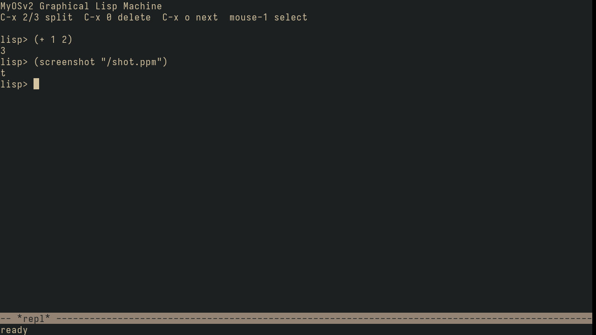

# MyOSv2

A little operating system for **ARM64 (AArch64)**, written from scratch in C and
assembly, running on QEMU's `virt` board.

This is a **vibe-coded OS, built just for fun** — to learn how computers and
operating systems actually work, and to see how far we can get. No grand plan, no
deadlines; just building it one piece at a time and enjoying the ride.

## What it can do today

- **Boot & serial** — `_start`, stack/`.bss` setup, PL011 UART, `kprintf`.
- **Exceptions & interrupts** — vector table, syscalls (`svc`), GIC, 1000 Hz timer.
- **Memory** — physical page allocator, a coalescing kernel heap, the MMU with
  per-process page tables, ASID-tagged TLB entries (flush-free context switch).
- **Scheduler** — preemptive threads with priorities, sleep, round-robin, and a
  V6-style **sleep/wakeup** (`sched_block`/`sched_wake`) so blocking I/O sleeps
  instead of spinning.
- **Interrupt-driven I/O** — the console and NIC are driven by interrupts, not
  polling: a UART receive IRQ feeds the **tty line discipline** (Ctrl-C → SIGINT),
  `read` blocks until a key is pressed, and the virtio-net IRQ wakes the network
  stack (a blocked `ping` is woken by the reply, or aborted instantly by Ctrl-C).
- **Filesystem** — a VFS (vnode/fs_type) with an in-memory `ramfs` and an initrd.
- **Processes** — user mode at EL0, `fork` + copy-on-write, an **ELF64 loader**,
  and the full lifecycle: `exec`, `exit(status)`, `wait`/reap (with ASID + page
  recycling).
- **Userland** — an interactive shell that runs real ELF programs from `/bin`
  (`true`, `false`, `hello`, `mtest`) via fork→exec→wait and reports their exit
  status. (Since Phase 24 the C shell lives at `/bin/sh`; **init is the Lisp
  machine** — see below.)
- **User-space memory** — `sbrk`-grown per-process heap (demand-zeroed pages) and
  a small `malloc`/`free`; anonymous `mmap`; and **shared memory** objects two
  processes can map to communicate.
- **Pipes** — `pipe` + `dup2` with refcounted file handles, so the shell runs
  pipelines like `hello | wc`.
- **Signals** — `kill`, default actions, user handlers (with a sigreturn
  trampoline), and **Ctrl-C** → `SIGINT` to the foreground program.
- **Block device** — a **virtio-blk** disk driver on a generic virtio-mmio +
  virtqueue layer, reading and writing 512-byte sectors.
- **Persistent filesystem** — a small on-disk inode FS (SFS) mounted at `/disk`;
  files survive reboots.
- **Network interface** — a **virtio-net** driver that sends and receives raw
  Ethernet frames (verified with an ARP round-trip to QEMU's gateway).
- **TCP/IP stack** — Ethernet, **ARP** (resolve/cache/reply), **IPv4** (checksum
  + next-hop routing), **ICMP** echo, **UDP**, and a minimal **TCP** client with
  **out-of-order reassembly** (a dropped/reordered segment no longer discards the
  rest of the stream), **adaptive retransmission** (RFC 6298 RTO estimation,
  Karn's algorithm, exponential backoff), **flow control** (honors the peer's
  advertised window; advertises its own from real receive-buffer space), and
  **Reno congestion control** (slow start, congestion avoidance, fast
  retransmit/recovery), and a **full RFC 793 state machine** (graceful four-way
  close — CLOSE_WAIT/LAST_ACK, FIN_WAIT/CLOSING/TIME_WAIT — and RST replies to
  stray segments). Writes larger than one MSS are **segmented** and pipelined up
  to the window (with Nagle); `/bin/httpd` serves a 4 KB body in several segments.
- **Sockets** — a BSD-style socket API: `socket`/`bind`/`sendto`/`recvfrom` for
  UDP datagrams, and `socket(SOCK_STREAM)`/`connect`/`listen`/`accept` +
  `read`/`write` for TCP — both client *and* server. `/bin/dnsq` does a DNS lookup
  over UDP sockets; `/bin/http` fetches a page over TCP (`GET example.com` →
  `HTTP/1.1 200 OK`) — out to the real internet; `/bin/httpd` is a tiny HTTP
  server: run it, then `curl http://localhost:8080/` from the host reaches it
  (QEMU forwards host:8080 → guest:8080). `poll()` waits on several fds at once
  (sockets, pipes); `shutdown()` half-closes a TCP connection. `/bin/polldemo`
  shows `poll()` blocking on a pipe a forked child fills.
- **DNS + ping** — a **DNS resolver** over UDP (now with a real **UDP transmit
  checksum**) and a user-space `ping` that takes a hostname:
  `ping https://www.google.com` strips the scheme, resolves the name, and
  ICMP-echoes the address.
- **DHCP** — the guest **leases its address at boot** (DISCOVER/OFFER/REQUEST/ACK)
  instead of hardcoding it, **applies the offered gateway/DNS/subnet mask**, and
  **renews the lease** (RFC 2131 T1 renew / T2 rebind, activity-driven). The whole
  stack is runtime-configurable, falling back to built-in defaults if no server
  answers.
- **Program arguments** — `exec` passes `argv` to programs; the shell tokenizes
  the command line, so `/bin/ping <host>` and friends get their arguments.
- **`shutdown`** — a shell command that halts the machine via PSCI (QEMU exits).
- **Lisp machine** — `/bin/lisp` is a full **Emacs-architecture Lisp** running at
  EL0: tagged 64-bit objects, a **mark-and-sweep collector with conservative
  C-stack scanning** (so it can collect mid-computation in a long-lived process),
  **Lisp-2** with separate value/function slots, tail-call optimization, closures
  and `defmacro`. The reader/evaluator/printer are a single portable core shared
  with the kernel, so the in-kernel test suite red-greens the language itself. It
  boots its standard library from `/lib/bootstrap.l` and gives you an interactive
  REPL with error recovery (a typo doesn't kill the session). The plan is for Lisp
  to become the primary userland — see **[docs/ROADMAP.md](docs/ROADMAP.md)**.
- **Network REPL (Emacs ↔ the live image)** — `lisp -serve` serves the REPL over
  TCP (blocking `accept`, one connection at a time); QEMU forwards host:7777 →
  guest:7777. The image **persists across connections** — disconnect, reconnect,
  and your defuns are still there. `user/lisp/lm-mode.el` wires it into (Doom)
  Emacs: `M-x lm-connect`, then `C-c C-e` evals the form before point into the
  running OS. **The connection is the terminal**: the socket is `dup2`'d onto
  fds 0/1/2 for the session, so errors, `(run ...)` output and even pipelines
  with in-image stages all come back to your editor, remote-shell style.
- **Lisp ↔ kernel** — the syscalls are Lisp primitives (`user/lm_sys.c`):
  `(fork)`, `(exec path argv)`, `(wait)`, pipes, `dup2`, files and sockets.
  `(if (= (fork) 0) (exec "/bin/hello" ...) (wait))` is the whole Unix process
  model in one S-expression, typed into a live REPL.
- **The shell is Lisp** — `system.l` builds an Eshell-style shell from those
  primitives: `(run "hello" "arg")` fork/execs an ELF and waits;
  `(| (run "hello") (run "wc"))` is a real pipe between forked children — and
  stages can be plain Lisp: `(| (princ "abcde") (run "wc"))` → `5`. `(ls)` and
  `(cat ...)` are coreutils written in Lisp.
- **Input devices** — IRQ-driven **virtio-input** keyboard + absolute-pointer
  tablet; events reach userland as evdev triples through a blocking
  `input_read` syscall (`/bin/evtest` to watch them). First brick of the
  graphical Lisp machine (Phase 25).
- **Display** — a **virtio-gpu** framebuffer: `gfx_acquire` maps a 1280×720
  BGRX framebuffer into a process; `gfx_flush` pushes damage rects to the
  scanout. `/bin/gfxtest` paints the screen from userland, verified down to
  exact pixels by a QMP screendump check.
- **The graphical Lisp machine** — `lisp -frame` boots an Emacs-style frame:
  tiled windows showing buffers, modelines, an echo area, a block cursor — the
  redisplay engine (`src/rd_core.c`, glyph matrices + damage diff) is C; the
  event loop, keymaps (`C-x 2/3/0/o`), mouse handling and the REPL itself are
  **live Lisp** (`frame.l`) you can redefine from that very REPL. The machine
  can photograph itself: `(screenshot "/shot.ppm")`. Text is **anti-aliased**
  (prerendered TTF glyphs, integer alpha blending — no FPU needed).
  **Multiple Lisp VMs**
  share the screen VT-style — `(spawn-vm)`, then Ctrl-Alt-F1..F4 — and a
  buffer can be a **pixel surface** that an external program renders into via
  shared memory (`(run-in-buffer buf "surftest")`) — EXWM, native.
  
  
- **init IS the Lisp machine** — PID 1 is `/bin/lisp`: the OS **boots into a
  Lisp REPL** (which refuses to die on EOF — it's init). The C shell survives
  as an ordinary command: `(run "sh")` drops you into it, `exit` falls back to
  Lisp. Start the network REPL with `(run "lisp" "-serve")` and hack the
  running machine from Emacs.

Where it goes next lives in **[docs/ROADMAP.md](docs/ROADMAP.md)** — currently
Phase 25: the **graphical Lisp machine** (Emacs architecture, tiled buffers,
multiple swappable Lisp VMs).

## Try it

```sh
make run     # boot it in QEMU -- you land in the Lisp REPL (PID 1)
make test    # run the in-kernel self-test suite
```

At the `lisp> ` prompt: `(run "sh")` for the classic shell, `(ls "/bin")`,
`(| (run "hello") (run "wc"))`, or `(run "lisp" "-serve")` and connect from
Emacs (`user/lisp/lm-mode.el`, port 7777).

You'll need an `aarch64-elf` cross-toolchain and `qemu-system-aarch64`.

## How it's built

Every feature goes through the same loop: a design spec, a test-first plan, then
TDD implementation gated by `make test` (a pre-commit hook blocks commits if any
test fails). Specs live in `docs/superpowers/`, notes in `docs/notes/`.

Built with a lot of help from Claude. It's a playground — expect rough edges.
